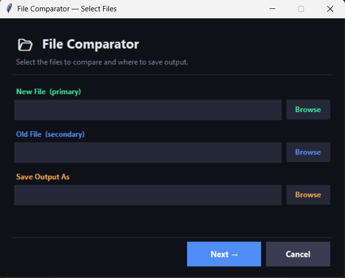
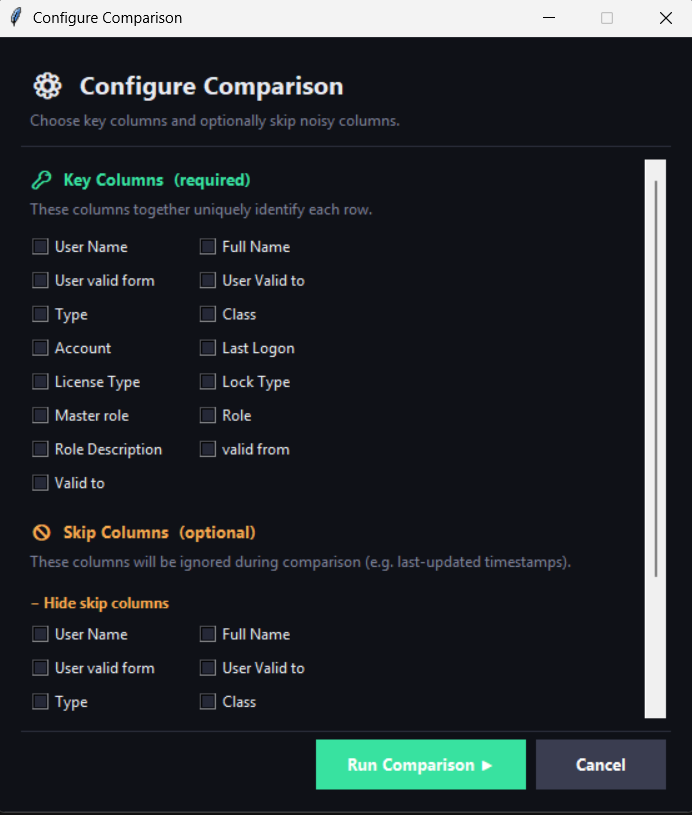
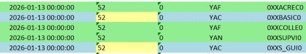
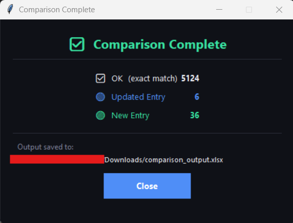

# 📊 Excel Data Comparator (GUI Tool)

A Python-based desktop application to compare Excel and CSV files and automatically detect **new, updated, and unchanged records** with clear visual highlighting.

---

## 🚀 Overview

Manually comparing large Excel files is time-consuming and error-prone.
This tool automates the process by identifying:

* ✅ Exact matches
* 🔵 Updated entries (with cell-level differences)
* 🟢 New entries

It generates a final Excel file with **color-coded highlights**, making data auditing fast and intuitive.

---

## ✨ Features

* 📂 Supports `.xlsx`, `.xls`, and `.csv` files
* 🔑 Select **key columns** to uniquely identify records
* 🚫 Option to **skip columns** (e.g., timestamps, IDs)
* 🎨 Automatic highlighting:

  * 🟢 New rows
  * 🔵 Updated rows
  * 🟡 Changed cells
* 🖥️ User-friendly GUI (built with tkinter)
* ⚠️ Built-in validation and error handling

---

## 🖼️ Screenshots

### 📂 File Selection



---

### ⚙️ Configure Comparison (Key + Skip Columns)



---

### 📊 Final Output (Excel Highlights)



> Green = New rows | Blue = Updated rows | Yellow = Changed cells

---

### ✅ Comparison Summary



---

## ⚙️ Installation

Clone the repository:

```bash
git clone https://github.com/SnehaDeshmukh28/Excel_Data_Comparator.git
cd Excel_Data_Comparator
```

Install dependencies:

```bash
pip install -r requirements.txt
```

---

## ▶️ How to Run

```bash
python app.py
```

---

## 🧠 How It Works

1. Select the **new file** and **old file**
2. Choose where to save the output
3. Select **key columns** (used to match rows)
4. Optionally select **columns to ignore**
5. Run comparison

The tool:

* Matches rows based on key columns
* Detects differences
* Generates a new Excel file with highlights

---

## 🛠️ Tech Stack

* **Python**
* **pandas** – data processing
* **openpyxl** – Excel manipulation
* **tkinter** – GUI

---

## 📁 Project Structure

```
excel-data-comparator/
│
├── app.py
├── requirements.txt
├── README.md
├── screenshots/
│   ├── file_selection.png
│   ├── configure_comparison.png
│   ├── excel_output.jpeg
│   ├── comparison_complete.png
```

---

## 🤝 Contributing

Contributions are welcome!
Feel free to open issues or submit pull requests.

---

## 📄 License

MIT License

---

## 🙌 Acknowledgment

Built to solve real-world Excel comparison problems and reduce manual effort in data workflows.
